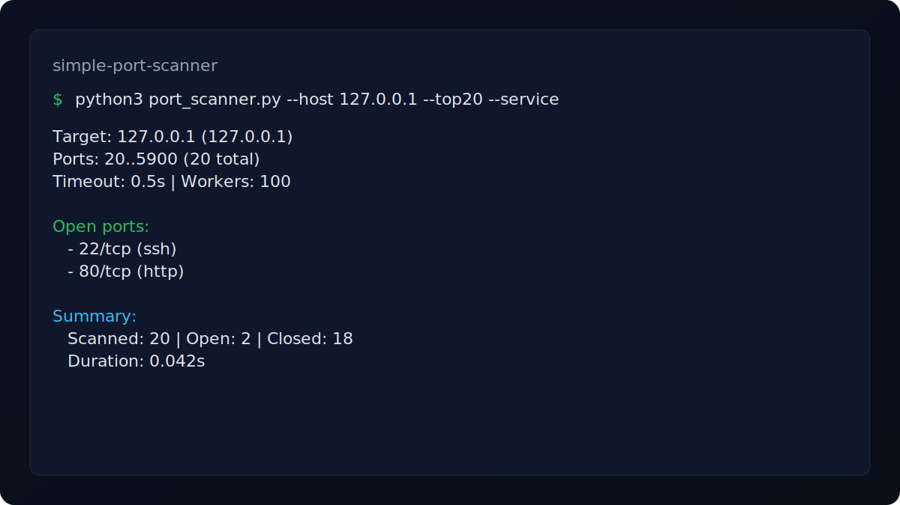

# Simple Port Scanner (Educational)

[](LICENSE)
[](https://www.python.org/)

Safe-by-default TCP port scanner for learning and testing on systems you own
or have explicit permission to assess.

## Features
- Single host scanning (hostname or IP)
- Custom port lists and ranges (e.g. `22,80,443,8000-8100`)
- Presets for common ports and top 20 ports
- Timeouts, concurrency limits, and optional scheduling delays
- Optional lightweight service guess for open ports
- Output to text, JSON, or CSV (with open-only option)

## Requirements
- Python 3.8+

## Quick Start
```bash
python3 port_scanner.py --host 127.0.0.1 --top20
```

## Screenshot


## Usage
```bash
python3 port_scanner.py --help
```

## Examples
```bash
python3 port_scanner.py --host 127.0.0.1 --ports 22,80,443
python3 port_scanner.py --host localhost --ports 8000-8100
python3 port_scanner.py --host 127.0.0.1 --ports 1-1024 --workers 50
python3 port_scanner.py --host 127.0.0.1 --common
python3 port_scanner.py --host 127.0.0.1 --top20
python3 port_scanner.py --host 127.0.0.1 --ports 1-1024 --sequential
python3 port_scanner.py --host 127.0.0.1 --ports 1-1024 --delay 0.01
python3 port_scanner.py --host 127.0.0.1 --ports 1-1024 --service
python3 port_scanner.py --host 127.0.0.1 --ports 1-1024 --output results.json
python3 port_scanner.py --host 127.0.0.1 --ports 1-1024 --output results.csv
python3 port_scanner.py --host 127.0.0.1 --ports 1-1024 --open-only --output results.json
python3 port_scanner.py --host 127.0.0.1 --ports 1-1024 --no-color
python3 port_scanner.py --host 127.0.0.1 --ports 1-1024 --no-progress
```

## Example Output
```text
Target: 127.0.0.1 (127.0.0.1)
Ports: 20..5900 (20 total)
Timeout: 0.5s | Workers: 100

Open ports:
- 22/tcp (ssh)
- 80/tcp (http)

Summary:
Scanned: 20 | Open: 2 | Closed: 18
Duration: 0.042s
```

## Output
- Text output lists `port/tcp` and status.
- JSON includes `target`, `scanned_ports`, `open_ports`, `duration_seconds`, and `results`.
- CSV columns are `port`, `open`, and `service`.

## Safety Notes
- Only scan targets you own or have permission to test.
- This tool performs a basic TCP connect scan and does not attempt to evade detection.

## License
MIT. See `LICENSE`.
